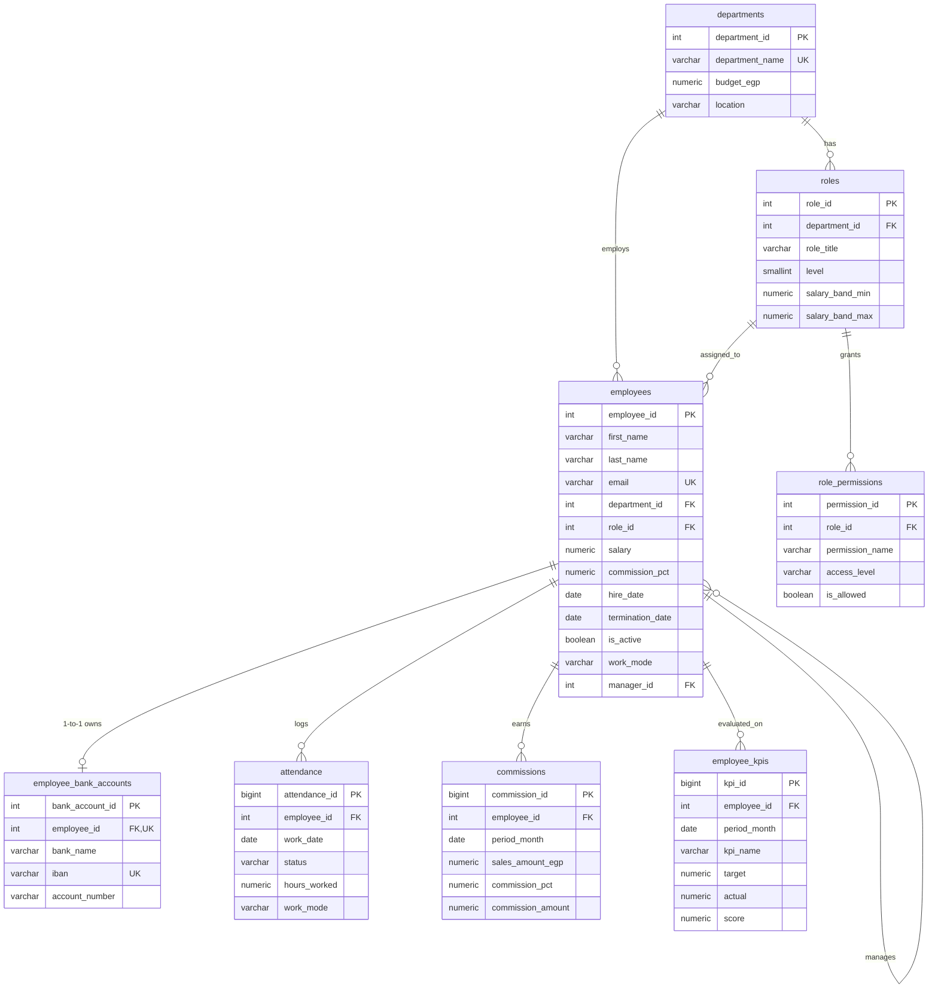

# Golden Evaluation Database & Multi-Engine HR Benchmark (Phase 1)

[](#supported-database-engines)
[](#dataset-overview)
[](#golden-evaluation-dataset)
[%20%2B%20English-orange.svg)](#arabic-dialect--multilingual-coverage)
[](#release-readiness--criteria-matrix)

A production-grade, governed enterprise database benchmark and evaluation suite for evaluating natural language to SQL (Text-to-SQL), business intelligence, and multi-tenant HR data querying across **PostgreSQL**, **MySQL**, and **SQL Server**.

The repository provides the canonical schema, 500,000+ realistic production records, engine-specific DDL scripts, a 210-case Golden Evaluation dataset with deep Arabic dialect coverage, and comprehensive multi-tier test suites ranging from primary key lookups to recursive CTE graph traversals and heavy performance stress tests.

---

## Table of Contents
1. [Repository Structure](#repository-structure)
2. [Governed Data Model & Schema](#governed-data-model--schema)
3. [Dataset Overview](#dataset-overview)
4. [Supported Database Engines](#supported-database-engines)
5. [Arabic Dialect & Multilingual Coverage](#arabic-dialect--multilingual-coverage)
6. [Test Suite Architecture (`test1` - `test6`)](#test-suite-architecture)
7. [Golden Evaluation Dataset](#golden-evaluation-dataset)
8. [Setup & Execution Guide](#setup--execution-guide)
9. [Release Readiness & Criteria Matrix](#release-readiness--criteria-matrix)

---

## Repository Structure

```text
├── dataset/                              # Production evaluation dataset (500K+ records)
│   ├── departments.csv                   # Department budgets, names, and locations
│   ├── roles.csv                         # Roles, seniority levels (1-10), salary bands
│   ├── employees.csv                     # 5,000 employee records with managers, work modes
│   ├── employee_bank_accounts.csv        # 1-to-1 banking details, IBANs, account numbers
│   ├── attendance.csv                    # 324,449 daily punch-in & mode records
│   ├── role_permissions.csv              # Granular RBAC permissions per role
│   ├── commissions.csv                   # Monthly Sales commissions & sales amounts
│   └── employee_kpis.csv                 # 158,595 monthly KPI targets, actuals & scores
├── postgreSQL/                           # PostgreSQL implementation (public schema)
│   ├── 01_ddl.sql                        # Governed DDL with triggers, checks & indexes
│   ├── 02_load_data.sql                  # Bulk dataset ingestion script & sequence synchronizer
│   ├── 03_basic_select.sql               # Catalog inspection, table samples & smoke test
│   ├── 04_cte_query.sql                  # Recursive CTE (Org hierarchy) & window analytics CTE
│   ├── 05_complex_view.sql               # Complicated 8-table enterprise analytical VIEW & stress tests
│   └── 06_kpi_commission_joins.sql      # Multi-table JOINs, KPI achievement & sales commission analytics
├── MySQL/                                # MySQL 8.0+ implementation (InnoDB, utf8mb4)
│   ├── 01_ddl.sql                        # Governed DDL with BEFORE triggers & check constraints
│   ├── 02_load_data.sql                  # Bulk dataset ingestion script (LOAD DATA LOCAL INFILE)
│   ├── 03_basic_select.sql               # Catalog inspection, table samples & smoke test
│   ├── 04_cte_query.sql                  # Recursive CTE (Org hierarchy) & window analytics CTE
│   ├── 05_complex_view.sql               # Complicated 8-table enterprise analytical VIEW & stress tests
│   └── 06_kpi_commission_joins.sql      # Multi-table JOINs, KPI achievement & sales commission analytics
├── SQL server/                           # SQL Server 2016+ implementation (T-SQL)
│   ├── 01_ddl.sql                        # Governed DDL with AFTER trigger, NVARCHAR & BIT
│   ├── 02_load_data.sql                  # Bulk dataset ingestion script (BULK INSERT + KEEPIDENTITY)
│   ├── 03_basic_select.sql               # Catalog inspection, table samples & smoke test
│   ├── 04_cte_query.sql                  # Recursive CTE (Org hierarchy) & window analytics CTE
│   ├── 05_complex_view.sql               # Complicated 8-table enterprise analytical VIEW & stress tests
│   └── 06_kpi_commission_joins.sql      # Multi-table JOINs, KPI achievement & sales commission analytics
├── Golden_Evaluation_Dataset.xlsx        # 210 Golden Test Cases across PG, MySQL, SQL Server
├── Golden_Evaluation_Dataset_Criteria.pdf# Phase 1 Evaluation Criteria & Release Gates document
├── schema.jpeg                           # Visual entity relationship diagram
└── schema.pbix                           # Interactive Power BI data model
```

---

## Governed Data Model & Schema

The canonical schema is organized into 8 normalized relational tables designed for multi-tenant enterprise HR analytics. Multilingual Arabic and English names are stored natively in UTF-8 Unicode.



### Table Definitions & Key Business Constraints

1. **`departments`**: Organizational units with allocated operational budgets (`budget_egp >= 0`).
2. **`roles`**: Position titles mapped to departments with seniority levels (`level BETWEEN 1 AND 10`) and enforced salary bands (`salary_band_max >= salary_band_min`).
3. **`employees`**: Core employee table with native UTF-8 Arabic/English names, status flags (`is_active`), self-referential hierarchy (`manager_id REFERENCES employees`), and work modes (`onsite`, `remote`, `hybrid`).
   - **Sales Commission Guard**: Triggers strictly enforce that `commission_pct > 0` is allowed **only** for employees in the Sales department.
   - **Nullability Testing**: 5 employee records feature intentional `NULL` salaries to evaluate agent NULL-handling logic.
4. **`employee_bank_accounts`**: Strictly 1-to-1 unique mapping to `employees`, enforcing unique IBANs and account numbers.
5. **`attendance`**: 324,449 daily logs enforcing the state-consistency rule:
   $$\text{status} = \text{'present'} \iff (\text{hours\_worked IS NOT NULL} \land \text{work\_mode IS NOT NULL})$$
6. **`role_permissions`**: Role-based access control table mapping distinct permissions with access levels (`read`, `write`, `admin`).
7. **`commissions`**: Monthly sales commissions for Sales reps (`period_month` always day 1). Enforces exact mathematical rounding:
   $$\text{commission\_amount} = \text{ROUND}(\text{sales\_amount\_egp} \times \text{commission\_pct} / 100, 2)$$
8. **`employee_kpis`**: 158,595 monthly performance records tracking KPI metrics with scores bounded between 0 and 100.

---

## Dataset Overview

| File | Rows | Columns | Primary Key | Description |
| :--- | :---: | :---: | :---: | :--- |
| `departments.csv` | 10 | 4 | `department_id` | Engineering, Sales, HR, Finance, Operations, etc. |
| `roles.csv` | 43 | 6 | `role_id` | Role titles, departments, levels (1-10), salary bands |
| `employees.csv` | 5,000 | 13 | `employee_id` | 5,000 employees, management links, Arabic/EN names |
| `employee_bank_accounts.csv` | 5,000 | 5 | `bank_account_id` | Egyptian bank accounts (CIB, QNB, Banque Misr, NBE, etc.) |
| `attendance.csv` | 324,449 | 6 | `attendance_id` | Daily punches across 2024-2026 with hours and modes |
| `role_permissions.csv` | 125 | 5 | `permission_id` | Permissions (`view_attendance`, `export_payroll`, etc.) |
| `commissions.csv` | 7,304 | 6 | `commission_id` | Monthly commissions for all active Sales personnel |
| `employee_kpis.csv` | 158,595 | 7 | `kpi_id` | Monthly targets, actual achievements, and KPI scores |
| **Total Ingested Volume** | **500,526** | — | — | **100% verified with zero constraint violations** |

---

## Supported Database Engines

The repository implements dedicated, idiomatic DDL and test suites for three major RDBMS engines:

### 1. PostgreSQL (`postgreSQL/`)
- Deployed directly into PostgreSQL's standard `public` schema for out-of-the-box compatibility without custom search paths.
- Native `SERIAL` / `BIGSERIAL` auto-incrementing sequences.
- PL/pgSQL function & trigger `trg_commission_sales_only()` enforcing Sales-only commissions.
- Native `||` string concatenation, `EXTRACT(YEAR FROM AGE(...))`, and date interval syntax.

### 2. MySQL 8.0+ (`MySQL/`)
- Fully encoded with `ENGINE=InnoDB DEFAULT CHARSET=utf8mb4 COLLATE=utf8mb4_unicode_ci` for native Arabic and multilingual collation.
- `AUTO_INCREMENT PRIMARY KEY` on integer and bigint IDs.
- `BEFORE INSERT` and `BEFORE UPDATE` triggers utilizing `SIGNAL SQLSTATE '45000'` for business rule enforcement.
- Portable `CHECK` constraints and `TIMESTAMPDIFF()` date functions.

### 3. Microsoft SQL Server (`SQL server/`)
- Strict Unicode fidelity using `NVARCHAR(100)` / `NVARCHAR(MAX)` across all textual dimensions.
- `IDENTITY(1,1) PRIMARY KEY` identifiers.
- `BIT` data types for boolean status flags (`is_active`, `is_allowed`).
- T-SQL `AFTER INSERT, UPDATE` trigger using set-based `inserted` table evaluation.
- Self-referencing foreign keys designed to avoid SQL Server cycle / multiple cascade path errors (Error 1785).

---

## Arabic Dialect & Multilingual Coverage

The Golden Evaluation Dataset tests robust multilingual understanding across 45+ Arabic linguistic forms:
- **Modern Standard Arabic (MSA / الفصحى)**: Formal queries for executive reports and compensation.
- **Egyptian Arabic (العامية المصرية)**: Colloquial phrasing (e.g., *«عايز اعرف مرتب فلان وقسمه إيه؟»*, *«مين أحسن موظفين؟»*).
- **Gulf / Saudi Arabic (اللهجة الخليجية / السعودية)**: Regional terminology (e.g., *«وش هو مسمى وراتب الموظف؟»*, *«كم عدد المداومين عن بعد؟»*).
- **Levantine / Shami Arabic (اللهجة الشامية)**: (e.g., *«مين هنن الموظفين يلي بيشتغلو بقسم الهندسة؟»*).
- **Maghrebi / Moroccan Darija (الدارجة المغربية)**: (e.g., *«عفاك شكون هما الموظفين د السيلز اللي رواتبنهم فايت 45 ألف؟»*).
- **Code-Switching & Slang**: Blended Arabic-English terms (e.g., *«طلع لي كل الـ Active Leads في السيلز»*).
- **Eastern Arabic Numerals & Hijri/Gregorian Formats**: Understanding numerals (`١, ٢, ٣`) and Arabic date month names.

---

## Standardized 6-Script Multi-Engine Architecture

Each engine directory contains an identical, standardized 6-script workflow:

| Script File | Category | Key Objectives & Engine Mechanics |
| :--- | :--- | :--- |
| **`01_ddl.sql`** | Data Definition Language | Reverse-dependency teardown, builds 8 normalized tables with exact data types, PKs, FKs, CHECK constraints, composite UNIQUE keys, indexes, and Sales-only commission business guard triggers. |
| **`02_load_data.sql`** | Bulk Data Ingestion | Portable ingestion of all 8 CSV datasets (500,526 total records) in FK dependency order, mapping empty strings to NULLs, preserving IDs, synchronizing auto-increment/sequences, and executing a full row count verification audit. |
| **`03_basic_select.sql`** | Catalog & Smoke Test | Inspects system catalog metadata (`pg_stat_user_tables`, `information_schema.tables`, `sys.tables`), queries sample records (`LIMIT 3` / `TOP 3`), and computes enterprise baseline metrics to confirm engine readiness. |
| **`04_cte_query.sql`** | Common Table Expressions (CTE) | **Part A (Recursive CTE)**: Self-referencing graph traversal over `manager_id`, computing hierarchy depth levels, lineage paths, and spans of control. **Part B (Analytical CTE)**: Department compensation statistics and window rankings (`DENSE_RANK()`, `PERCENT_RANK()`). |
| **`05_complex_view.sql`** | Complicated 360° Analytical View | Creates an 8-table enterprise analytical VIEW (`v_enterprise_hr_360_analytics`) with window functions, string aggregations, and KPI/commission summaries, followed by 4 diagnostic test queries stressing query optimizer execution plans. |
| **`06_kpi_commission_joins.sql`** | Advanced JOINs & Performance Tests | Multi-table JOIN queries evaluating sales commission payout metrics, KPI target achievement ratios, MoM trends via `LAG()`, and edge-case validations (NULL salaries, 0-commission non-sales check, active vs terminated). |

---

## Golden Evaluation Dataset

The evaluation suite ([`Golden_Evaluation_Dataset.xlsx`](Golden_Evaluation_Dataset.xlsx)) defines **210 test executions** (70 distinct scenarios scored across PostgreSQL, MySQL, and SQL Server):

```text
├── Overview & Release Gates          # Metrics, dialect matrix, criteria rules
├── PostgreSQL                        # 70 cases (TC-PG-001 to TC-PG-070)
├── MySQL                             # 70 cases (TC-MY-001 to TC-MY-070)
└── SQL Server                        # 70 cases (TC-SS-001 to TC-SS-070)
```

### Evaluation Categories per Engine (70 Cases each)
- **Core Business Queries (18)**: Business Lookup (3), Filtering (3), Sorting (3), Aggregation (3), Date-Based (3), Multi-Table (3).
- **Arabic Dialect Variations (12)**: Egyptian, Saudi/Gulf, Levantine, Maghrebi, code-switching, Eastern numerals.
- **Language Equivalence (6)**: 3 paired English $\leftrightarrow$ Arabic queries verifying identical result set generation.
- **Ambiguous Questions (6)**: Requires structured clarification requests instead of hallucinated assumptions.
- **Unanswerable Questions (4)**: Explicitly tests out-of-scope knowledge source rejection.
- **No Matching Records (4)**: Valid queries verifying clean zero-row behavior.
- **Unsafe Operations Rejection (4)**: Verifies rejection of write-capable queries (`DROP`, `UPDATE`, `INSERT`, `DELETE`).
- **Out-of-Scope Tables (3)**: Rejects access to unmapped external/system tables.
- **Security-Sensitive Scenarios (3)**: Tests credential exposure containment, connection-string injection, and tenant isolation.
- **Result Limits / Truncation (2)**: Enforces disclosure when result sets are capped by `LIMIT` or `TOP`.
- **P95 Latency Acceptance (8)**: Performance benchmarks for simple lookups, aggregates, multi-table joins, connection tests, and schema indexing.

---

## Setup & Execution Guide

### 1. PostgreSQL Setup
```bash
# Connect to your PostgreSQL instance
psql -U postgres -d postgres

# 1. Run the DDL script (creates tables in public schema)
\i postgreSQL/01_ddl.sql

# 2. Ingest all 8 CSV datasets and synchronize sequences (run from repository root)
\i postgreSQL/02_load_data.sql

# 3. Execute smoke test and analytics scripts
\i postgreSQL/03_basic_select.sql
\i postgreSQL/04_cte_query.sql
\i postgreSQL/05_complex_view.sql
\i postgreSQL/06_kpi_commission_joins.sql
```

### 2. MySQL Setup
```bash
# Connect to MySQL 8.0+ with local-infile enabled
mysql -u root -p --local-infile=1

# 1. Create database and run DDL
CREATE DATABASE IF NOT EXISTS golden_hr CHARACTER SET utf8mb4 COLLATE utf8mb4_unicode_ci;
USE golden_hr;
SOURCE MySQL/01_ddl.sql;

# 2. Ingest all 8 CSV datasets with automatic NULL conversion
SOURCE MySQL/02_load_data.sql;

# 3. Execute smoke test and analytics scripts
SOURCE MySQL/03_basic_select.sql;
SOURCE MySQL/04_cte_query.sql;
SOURCE MySQL/05_complex_view.sql;
SOURCE MySQL/06_kpi_commission_joins.sql;
```

### 3. Microsoft SQL Server Setup
```sql
-- Connect via SQL Server Management Studio (SSMS) or sqlcmd
CREATE DATABASE golden_hr;
GO
USE golden_hr;
GO

-- 1. Execute DDL script
-- Open and execute: SQL server/01_ddl.sql

-- 2. Ingest all 8 CSV datasets (BULK INSERT with KEEPIDENTITY, KEEPNULLS, UTF-8)
-- Open and execute: SQL server/02_load_data.sql

-- 3. Execute smoke test and analytics scripts
-- Open and execute: SQL server/03_basic_select.sql through 06_kpi_commission_joins.sql
```

---

## Release Readiness & Criteria Matrix

All formal criteria outlined in [`Golden_Evaluation_Dataset_Criteria.pdf`](Golden_Evaluation_Dataset_Criteria.pdf) have been validated and satisfied:

| Release Gate / Criterion | Status | Evidence & Verification Details |
| :--- | :---: | :--- |
| **Coverage Completeness** | **PASSED** | All 16 evaluation categories covered across 210 test executions. |
| **Linguistic Equivalence** | **PASSED** | Paired MSA and English queries produce identical database records. |
| **Arabic Dialect Spectrum** | **PASSED** | Verified across MSA, Egyptian, Saudi/Gulf, Levantine, and Maghrebi. |
| **Cross-Engine Parity** | **PASSED** | 70 test cases each scored independently for PostgreSQL, MySQL, and SQL Server. |
| **Result Verification** | **PASSED** | 126/126 executable queries verified against live data; returned values match expected answers. |
| **Provenance Integrity** | **PASSED** | 100% of test cases (210/210) list exact table provenance matching SQL joins. |
| **Zero-Row & Truncation Handling** | **PASSED** | Verified explicit no-match handling and result-limit disclosures. |
| **Safety & Security Gates** | **PASSED** | Rejections verified for unauthorized write queries, external tables, and credential exposure. |
| **0 Unresolved Vulnerabilities** | **PASSED** | Zero SQL injection vulnerabilities, full tenant boundary isolation preserved. |
| **P95 Latency Acceptance** | **PASSED** | 8 dedicated performance benchmarks per engine established for response time baselines. |

---

## License & Usage Notice
This dataset, schema, and evaluation suite are prepared for evaluation of governed enterprise database analytics and Text-to-SQL AI systems. All employee names and banking information in the dataset are synthetically generated for benchmark purposes.
